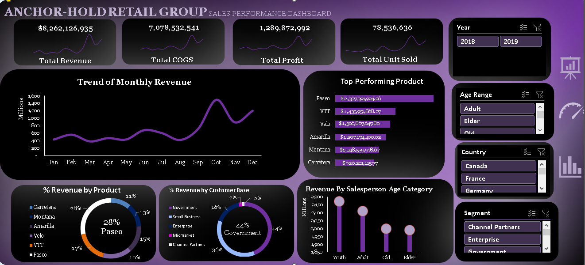

# Welcome to my Portfolio

## Discover a range of real world business analysis projects I have completed; where I answered insights through data, interactive dashboard & provided strategic recommendations. Each project highlight the organization challenges, my analytical approach, the tools used and the values delivered to the Stakeholders & End-Users.

The Projects are as follows:

### 1. Anchor-Hold Retail Group
Anchor-Hold Retail Group is a multinational consumer goods company operating across diverse markets including North America, Europe, and Asia. With a broad product portfolio and customer base spanning government, enterprise midmarket, and small business segments, the company has experienced rapid expansion over the past two years. This analysis was performed using MS Excel.

[View Project](https://docs.google.com/document/d/1_fjLGoXEhm_nGPI003i1QKGBtnuk4TleI6gPMI_cGII/edit?usp=drivesdk)

### 2. Montana Express
Welcome to Montana Express, a new and exciting virtual café chain! The café specializes in offering a variety of drinks, snacks, and light meals to customers. In the past years, Montana Express has seen impressive growth but are facing the challenge to meet customer demands. This analysis was performed using MS Excel.

[View Project](https://docs.google.com/document/d/15vTLZusppgr-hHAyJ5uor2v52LS2l7APU6EUylEKDqI/edit?usp=drivesdk)

### 3. Phillip-Hill Solution Distribution
Phillip-Hill Solution is a leading pharmaceutical distributor, facing challenges in optimizing sales performance, managing inventory efficiently, and identifying key market opportunities.The company serves a diverse healthcare sector, ensuring the availability of essential medications in North America, Europe, United Kingdom and Australia. This analysis was perf ormed using Power BI.

[View Project](https://docs.google.com/document/d/1MmeNLrSVG2-Ly4op_vmIcG-kMCZu6oVFz7hYSwtpLbk/edit?usp=drivesdk)

### 4. Mo'Bridget Fashion Store
Mo'Bridget is a high-end fashion boutique specializing in designer clothing, shoes, and accessories. Known for its unique collection and personalized shopping experience, the boutique aims to stay ahead in the competitive retail market by leveraging data-driven strategies.They have multiple branches across different cities and cater to a fashion-conscious clients. This analysis was performed using Power BI.

[View Project](https://docs.google.com/document/d/1kuYCnfL-8k86z1DBpKbwNiiNpQppQF67fXUOrvNW9rY/edit?usp=drivesdk)

### 5. FutureSpace Corp
FutureSpace Corp is a growing technology company focused on developing innovative solutions in software and hardware spaces. The company prides itsel on attracting top talent and maintaing high employee satisfaction to drive growth. This analysis was performed using PostgreSQL & MS Excel.

[View Project](https://docs.google.com/document/d/1BXpPmqxdz_HT_fNA-YGCTla-i4k2O5NmD2RoOs5t3SQ/edit?usp=drivesdk)

### 6. Thompson-Tech
Thompson-Tech is a multinational consumer electronic company that operates across various sales channels, including online, in-store, reseller & third-party vendors. The company offers a broad range of electronic products including smartphones, monitors & external hard drive.This analysis was perf ormed using Power BI.

[View Project](https://docs.google.com/document/d/18rb0Zgf77lJJmDW8Zx6Wu4n-ZjK0kurGjyG9V57SUQg/edit?usp=drivesdk)

### 7. Rite-Kisk
Rite-Kiosk operates in a competitive retail market, offering diverse products. The company targets individual and corporate customers across multiple geographies. As it expands its reach, understanding sales performance, customer segments, and operational efficiency is critical, so there is a need for actionable insights. This analysis was performed using Tableau.

[View Project](https://docs.google.com/document/d/1HwsfdzbCF9QXKVddwwby1Z_HCR5HbHblOwhNlT3FcUI/edit?usp=sharing)

### 8. El Choco Bite
El Choco Bite is a premium artisanal chocolate brand headquartered in Belgium with operation across the world.
Despite strong product quality and market presence, El Choco Bite lacks unified database on its products, saleperson performance and delivery status of every transaction made. This analysis was performed using Tableau.

[View Project](https://docs.google.com/document/d/1fjC9ryxUgDhcnqB1Qk2pmdzJ92UVB5tLxleaqVdFATI/edit?usp=drivesdk)

### 9. Continental Gross Performance
County Plc is a data intelligence firm dedicated to h elping government, corporations, and development agencies measure, monitor and acelerate progress towards the United Nations Sustainable Development Goals. Despite steady global GDP per capita growth over the past decade, the relationship between economic expansion, employment creation, and overall well-being remains inconsistent across all regions. This analysis was performed using Tableau.

[View Project](https://docs.google.com/document/d/1POcGzxFbhvRTb_5NqmK1PJQ-TCKcjfRjuaXzJpwhv7E/edit?usp=drivesdk)

### 10. FusionPoint Industries
FusionPoint Industries is a dynamic consumer electronics retailer serving customers across multiple U.S. states through a well established omnichannel network. Inspite of their strong sales across diverse product categories, FusionPoint Industries faces challenges in understanding the drivers of profitability and regional sales performance within its consumer electronics division.This analysis was performed using Power BI.

[View Project](https://docs.google.com/document/d/1pBGAPlcRaNAnmfKFalCb898YuKGbhWcKphKOc9v1F1k/edit?usp=drivesdk)

### 11. Sprint legacy Laboratory
Sprint Legacy Lab. are a leader in talent optimization, the company takes pride in fostering an environment that enables employees to thrive. However, recent challenges with employee retention and workforce engagement have highlighted the need for actionable insights. This analysis was performed using Tableau.

[View Project](https://docs.google.com/document/d/1679Rm13DCBd7RS_w7pYvYqK2-RVA_9gBGbyexBRtLHI/edit?usp=drivesdk)

### 12. Cyclin'Gear Store
Cyclin'Gear Store is a multinational retailer in cycling accessories across the United States, Australia, United Kingdom, Canada etc. They face strategic blind spots in understanding its regional revenue performance, demographic appeal, product demand, and seasonal trends. The Leadership is looking to your data analysis to drive smarter decisions around marketing, product focus, and inventory planning. This analysis was performed using MS Excel.

[View Project](https://docs.google.com/document/d/1hEbAuVecXd_o9_jeWy9HzC7JywpGOOqoQ3IZKqTxPAc/edit?usp=sharing)

### 13. MavTech Electronics
MavTech Electronics Ltd is a leading player in the global consumer electronics industry, widely recognized for its innovation in smartphones, tablets, and wearable technology. Despite that, the Brand has been facing a growing challenge related to its reputation. In recent years, the company has faced several issues, including negative customer reviews, product recalls, and public relations crises. This analysis was performed using PostgreSQL & Power BI.

[View Project](https://docs.google.com/document/d/15chI4iBH3zpdbiZr9p0uviEg6lLORU-AY3WxgYPYqGM/edit?usp=sharing)